## Part 1. Готовый докер

 * Docker pull, а так же docker images:

 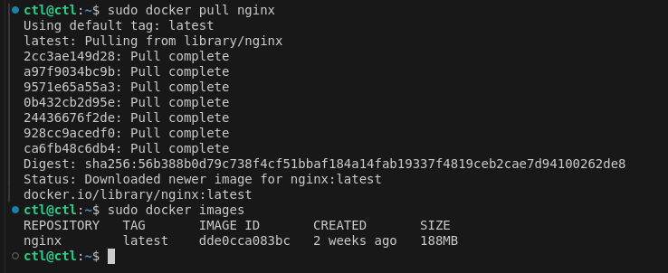

 * Запусти докер-образ через docker run -d + docker ps:

 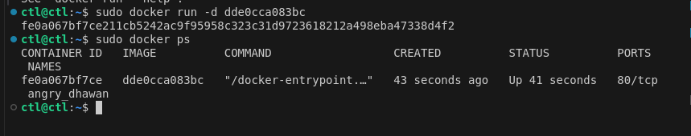

 -d - запуск контейнера в фоновом режиме

 * Посмотри информацию о контейнере через docker inspect + ip контейнера:

 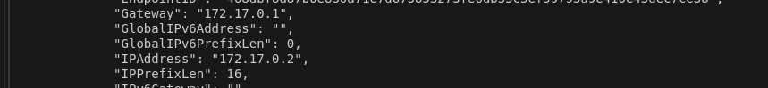

 * помести в отчёт размер контейнера:

 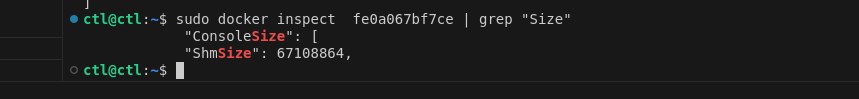

 * помести в отчёт список замапленных портов:

 

 * Останови докер образ через docker stop + docker ps:

 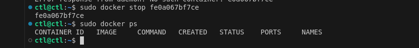

 * Запусти докер с портами 80 и 443 в контейнере:

 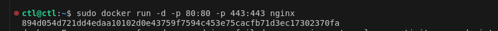

  Порт 80: Это стандартный порт для протокола HTTP который используется для передачи веб-страниц.

  Порт 443: Это стандартный порт для протокола HTTPS, который является безопасной версией HTTP.

 * Проверь, что в браузере по localhost:80 доступна страница nginx :

 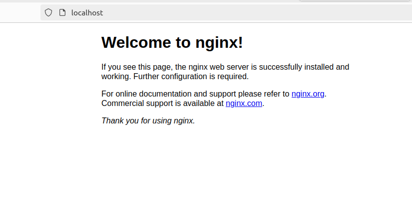

 * Перезапусти докер контейнер через docker restart:

 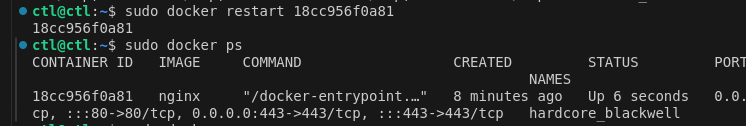

## Part 2. Операции с контейнером

 * Прочитай конфигурационный файл nginx.conf :

 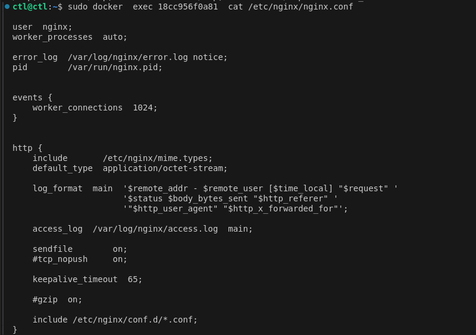

 * Создаем локальный файл nginx.conf,  так же  настраиваем  в нем по пути /status выдачу страницы статуса сервера:

 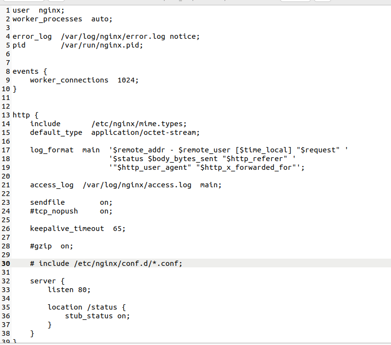

 * Скопируй созданный файл nginx.conf внутрь докер-образа, так же перезапусти nginx внутри докер-образа :

  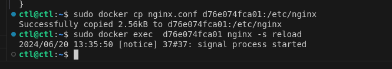

 * Проверь, что по адресу localhost:80/status отдается страничка со статусом сервера nginx:

 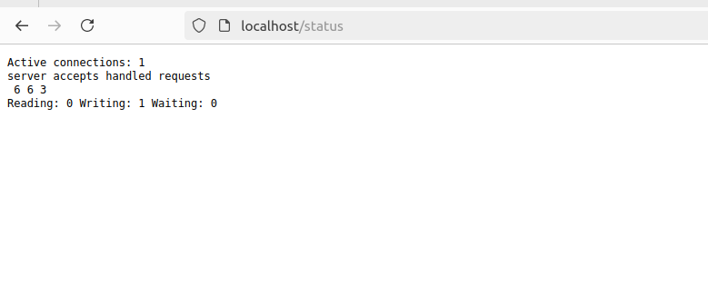

 * Экспортируй контейнер и потом останови его :
   
 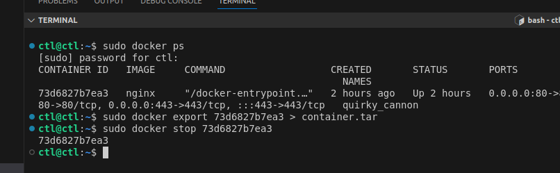

 * Удали образ через docker rmi:
   
  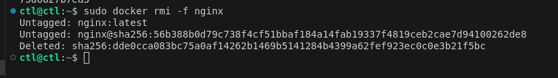

  флаг -f означает "force" (принудительно). Этот флаг используется для принудительного удаления образа

 * Удали остановленный контейнер :

  

 * Импортируй контейнер обратно через команду import:

  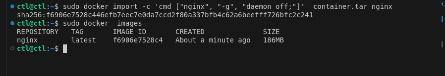

 docker import  создает новый образ Docker из файла tar, который содержит файловую систему контейнера. 

 -c используется для добавления Dockerfile-инструкций к создаваемому образу

 CMD ["nginx", "-g", "daemon off;"] устанавливает команду по умолчанию, которая будет выполняться при запуске контейнера. команда nginx -g daemon off; запускает Nginx в режиме "daemon off", что означает, что Nginx будет работать в переднем плане

 * Запусти импортированный контейнер:

  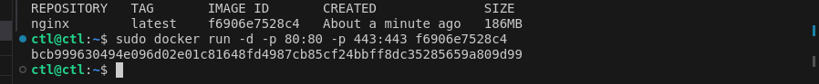

 * по адресу localhost:80/status отдается страничка со статусом сервера nginx:

  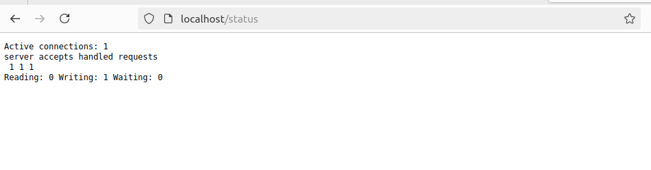

  ## Part 3. Мини веб-сервер

 FastCGI - ротокол для взаимодействия между веб-сервером и внешним программным обеспечением. 
 spawn-fcgi — это инструмент для управления процессами FastCGI. Он позволяет запускать FastCGI приложения и управлять их жизненным циклом

 * Запусти написанный мини-сервер через spawn-fcgi на порту 8080:

  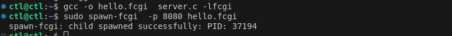
  

* Напиши nginx.conf, который проксирyeт все запросы с 81 порта на 127.0.0.1:8080:

  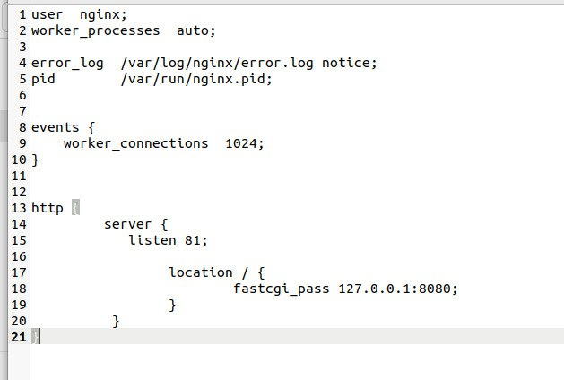

  повторяем шаги из 1 части :

  docker pull nginx - выкачиваем опять докер-образ

  docker run  - запускаем контейнер

  docker cp  -копируем в него из локальной машины файл конфигурации, затем и код

  docker exec - подключаемся к  крнтейнеру

  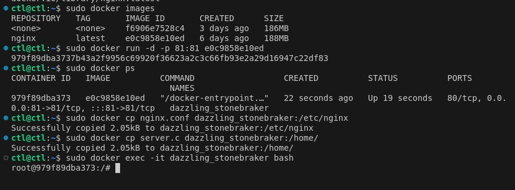

  Компилируем и запускаем сервер - spawn-fcgi
  перезапуск nginx на контейнере - nginx -s reload:

  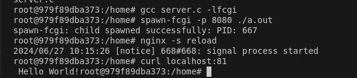

 * Проверь, что в браузере по localhost:81 отдается написанная тобой страничка:

  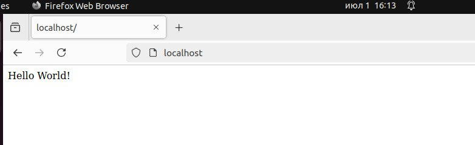

 * Положи файл nginx.conf по пути ./nginx/nginx.conf :

  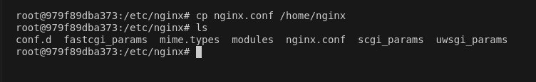

  ## Part 4. Свой докер

 * Напиши свой докер-образ, который:

 1) собирает исходники мини сервера на FastCgi из Части 3;

 2) запускает его на 8080 порту;

 3) копирует внутрь образа написанный ./nginx/nginx.conf;

 4) запускает nginx.

  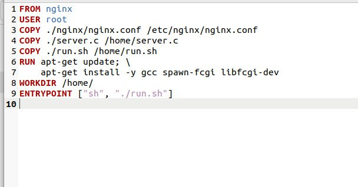

  Скрипт  компилирует и запускает server.c  nginx:

  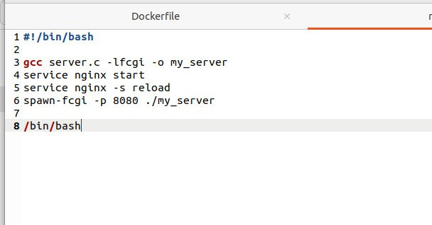

 * Cобери написанный докер-образ через docker build:

  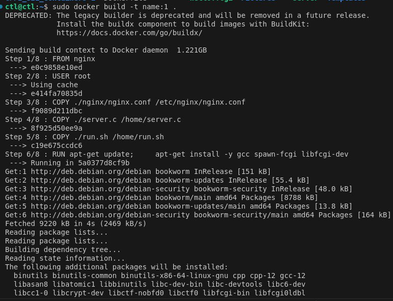

  -t позволяeт задать имя и тег образа

 * Проверь через docker images, что все собралось корректно:

  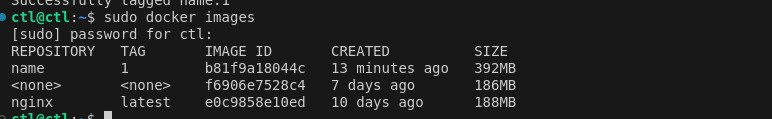

 * Запусти собранный докер-образ с маппингом 81 порта на 80 :

  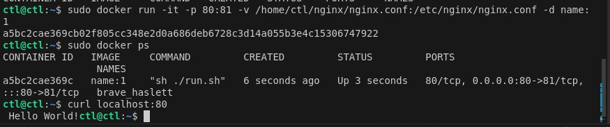

  -d - запускает контейнер в фоновом режимe

  -v  - используется для между хостовой системой и контейнером. -v позволяет указать путь на хосте и соответствующий путь в контейнере
  
 * Проверь, что по localhost:80 доступна страничка написанного мини сервера:

  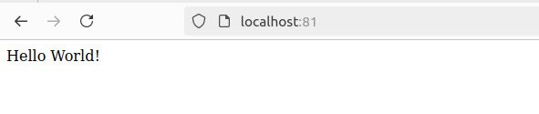

 * Допиши в ./nginx/nginx.conf проксирование странички /status:

  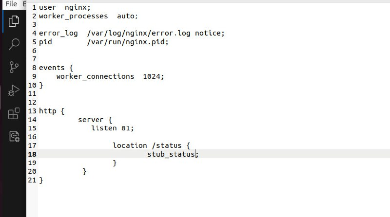

 * Перезапусти докер-образ + по localhost:80/status отдается страничка со статусом nginx:

  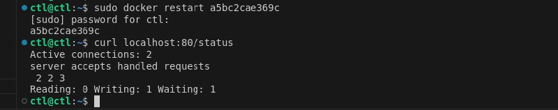

  ## Part 5. Dockle

  dockle — это инструмент для аудита безопасности Docker-образов. Он помогает обнаружить и исправить проблемы с безопасностью в Docker-образах перед их развертыванием.

 *  Просканируй образ из предыдущего задания :

  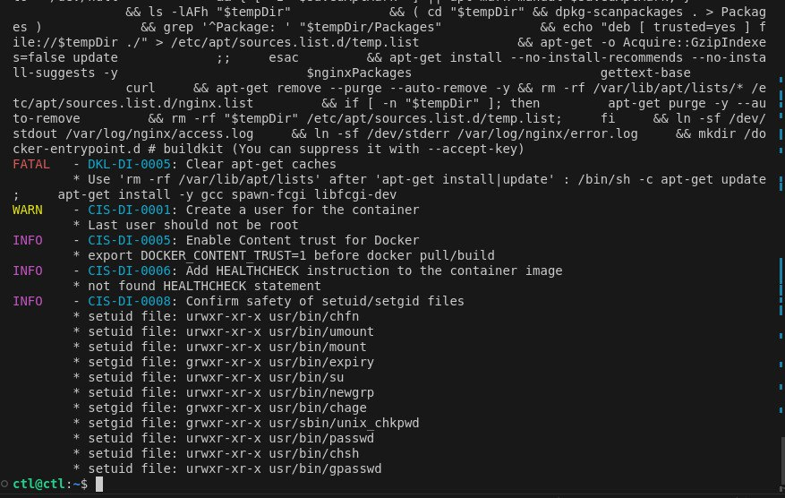

  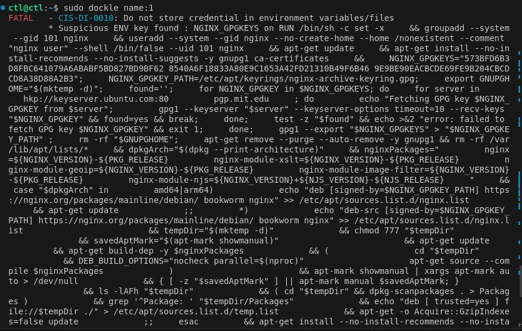

  - DKL-DI-0005 - Кэш не очищаeтся

  - CIS-DI-0001 - cоздайте и используйте непривилегированного пользователя для запуска приложений в контейнере. Это снизит риски безопасности.

  - CIS-DI-0010 - dockle необходимо запускать с дополнительными флагами.

  - CIS-DI-0005 - Установите переменную окружения DOCKER_CONTENT_TRUST=1 перед выполнением команд docker pull или docker build. Это обеспечит проверку подлинности образов.

  - CIS-DI-0008 - В образе присутствуют файлы с установленными битами setuid и setgid. настроить права пользователей для работы с файлами по списку, разрешить всем запускать скрипт и исполняемые файлы

  - CIS-DI-0006 - Добавьте инструкцию HEALTHCHECK в Dockerfile для мониторинга состояния контейнера

  * Исправь образ так, чтобы не было ошибок:

   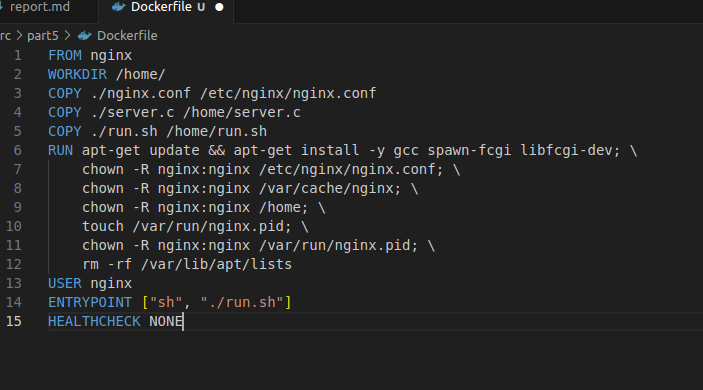

  - export DOCKER_CONTENT_TRUST=1 перед build'ом необходимо выполнить команду, чтобы убрать ошибку CIS-DI-0005. Потом билдим заново

  Проверяем:

  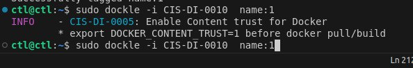

  ## Part 6. Базовый Docker Compose

  * Напиши файл docker-compose.yml:

  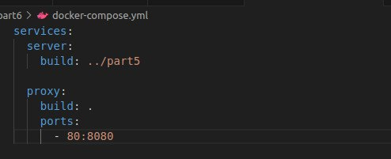

  * Подними докер-контейнер с nginx, который будет проксировать все запросы с 8080 порта на 81 порт первого контейнера:

  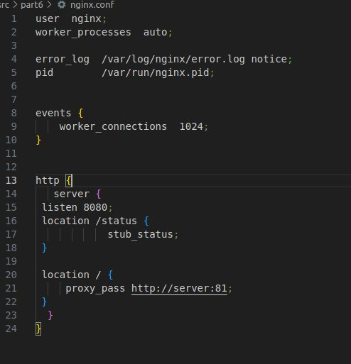

 * Собери и запусти проект с помощью команд docker-compose build и docker-compose up:
   
  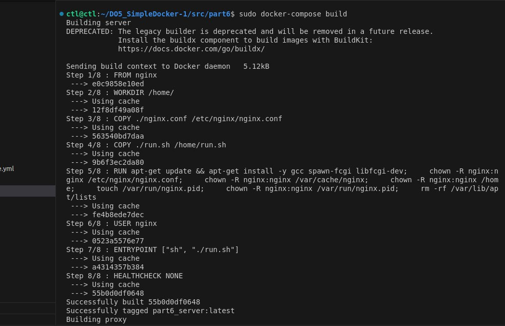

  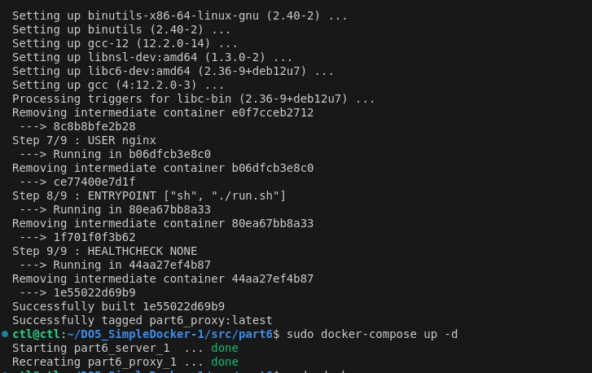

 * Проверь, что в браузере по localhost:80 отдается написанная тобой страничка:

   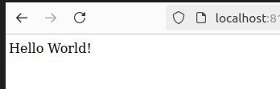